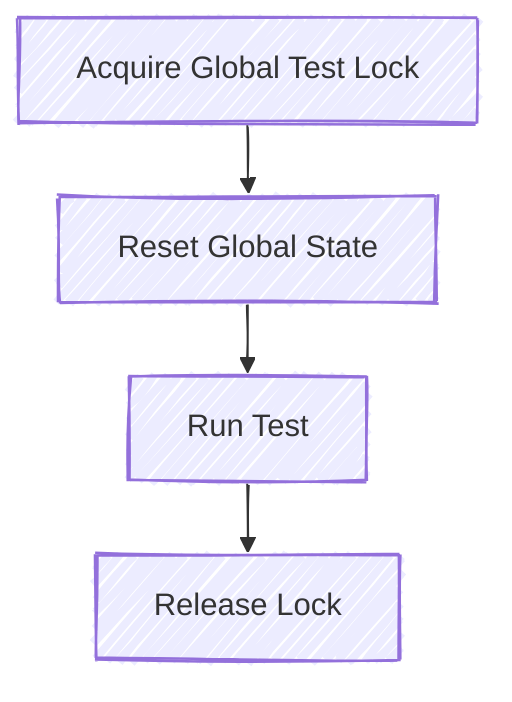

# Unit Testing

As mentioned in [Testing](../testing.md), unit tests are written in the same file as the code being tested. Tests
are placed in a conditionally compiled sub-module, and each test should be tagged with `#[test]`.

```rust
# #![feature(coverage_attribute)]
#[cfg(test)]
#[coverage(off)]
mod tests {
    #[test]
    fn test_my_functionality() {
        assert!(true);
    }
}
```

Since this conditionally compiled module is a sub-module of the module you are writing, it has access to all
private data in the module, allowing you to test public and private functions, modules, state, etc.

## Unit Testing and UEFI

Due to the nature of UEFI, there tend to be a large number of statics that exist for the lifetime of execution
(such as the GCD in the Patina DXE Core). This can make unit testing complex, as unit tests run in parallel, but
if there exists some global static, it will be touched and manipulated by multiple tests, which can lead to
deadlocks or the static data being in a state that the current test is not expecting. You can choose any pattern
to combat this, but the most common is to create a global test lock.

## Global Test Lock

The easiest way to control test execution—allowing parallel execution for tests that do not require global state,
while forcing all others to run one-by-one—is to create a global state lock. The flow is: acquire the global state
lock, reset global state, then run the test. It is up to the test writer to reset the state for the test. Here is
a typical example used in the Patina DXE Core:

```rust
# #![feature(coverage_attribute)]
#[coverage(off)]
mod test_support {
    static GLOBAL_STATE_TEST_LOCK: std::sync::Mutex<()> = std::sync::Mutex::new(());

    pub fn with_global_lock(f: impl Fn()) {
        let _guard = GLOBAL_STATE_TEST_LOCK.lock().unwrap();
        f();
    }
}

#[cfg(test)]
#[coverage(off)]
mod tests {
    use test_support::with_global_lock;
    fn with_reset_state(f: impl Fn()) {
        with_global_lock(|| {
            // Reset the necessary global state here
            f();
        });
    }

    #[test]
    fn run_my_test() {
        with_reset_state(|| {
            // Test code here
        });
    }
}
```



## Address Sanitizer (ASan)

When running unit tests, you can enable Address Sanitizer (ASan) to help detect memory errors. This is available on
Linux and Windows X64 hosts.

To run unit tests with Address Sanitizer enabled, use the following command:

```sh
cargo make test-asan
```

### Advanced Usage: Debugging ASan Test Executables Directly

On Windows, the tests executables built with ASan enabled have a dependency on the ASan DLL, which is not in the system
path by default. The `test-asan` task discovers the ASan DLL path on your system and sets it in the environment when
running tests, but if you want to run the test executable directly, you will need to set the environment variable
yourself.

You can find the ASan DLL path by running:

```sh
cargo make test-asan --print-dll-path
```

This will include surrounding `cargo make` output. You can script the call to just get the path to facilitate setting
the environment variable.

For example, in PowerShell:

```powershell
$asanPath = (cargo make test-asan --print-dll-path) -match '^[A-Z]:\\' | Select-Object -Last 1
$env:PATH = "$asanPath;$env:PATH"
```
