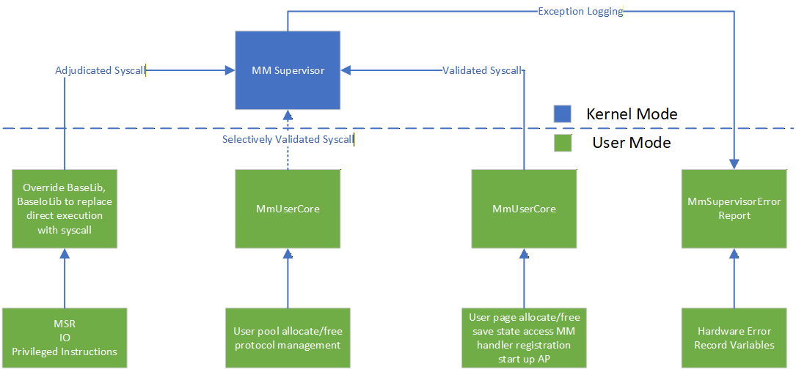
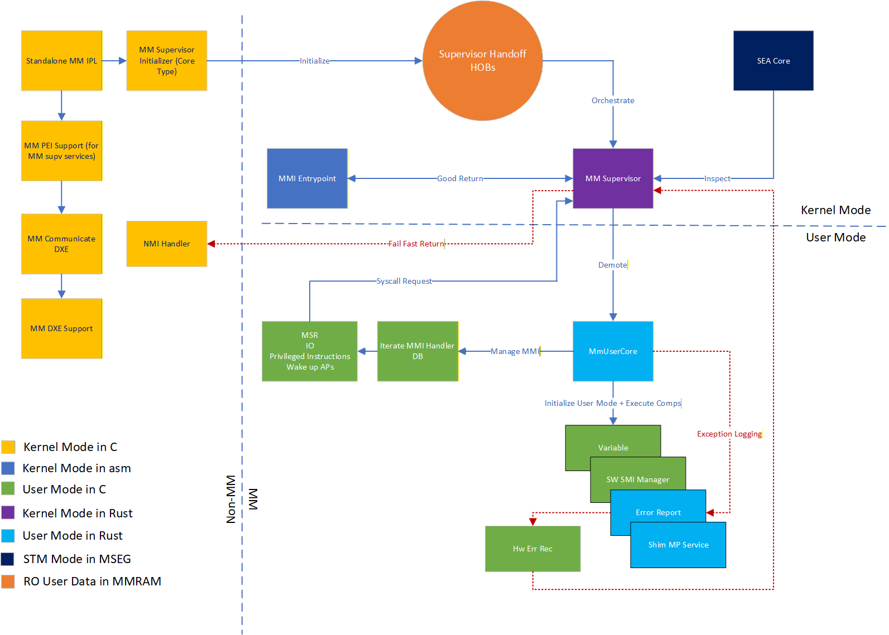

# RFC: `MM Supervisor in Rust`

This RFC proposes a Rust-based supervisor to manage management mode (MM) operations using the Patina framework.

## Change Log

- 2025-10-27: Initial RFC created.
- 2025-01-09: Updated data handoff to HOB based model, advanced lock down event, added nutrient content tables.
- 2025-02-23: Updated data handoff requirements after initial implementation. Added key differences from previous C implementations.

## Motivation

Privilege separation in MM is critical for secure and reliable firmware execution, as MM code handles sensitive tasks such
as system management interrupts (SMIs) and other privileged operations. By implementing the MM supervisor in Rust,
we aim to leverage Rust's safety guarantees, memory management, and concurrency features to enhance the robustness
of MM operations.

## Technology Background

### Standalone MM

Standalone MM is a PI specification defined operation for MM, where the MM core and its drivers run independently from the
non-MM environment. This allows for better isolation and security, as the MM code can operate without interference from
the main operating system or other firmware components.

See reference: [PI specification v1.9](https://uefi.org/specs/PI/1.9/V4_Overview.html#initializing-management-mode-in-mm-standalonemode)

### MM Supervisor

A [project MU feature](https://github.com/microsoft/mu_feature_mm_supv) implements a standalone MM supervisor in C. This
module provides supervised MM functionality.
Specifically, it manages MM handlers, MM protocol database, memory mapping, context switching, and secure execution of MM
code. However, it lacks the safety and modern features that Rust canc offer.

The goal of this RFC is to re-implement the critical MM supervisor functionalities (resource protection and page table management)
in Rust using the Patina framework. This will allow the supervisor entity in Trusted Execution Environment (TEE) to provide
the same level of protection while yielding less attack surfaces.

### Cross-Architecture Support

The standalone MM supervisor in C supports only x86_64 architecture. The Rust implementation for the core framework does
__NOT__ aim to support isolation for both x86_64 and AArch64 architectures due to architectural differences for AArch64
(secure partitions vs. supervisor-based isolation).

However, the Rust implementation of some common resultant functionalities within the scope of Standalone MM (such as TPM
services, UEFI variable services, etc.) will be supported across both x86_64 and AArch64 architectures, in the format of
both a Patina component and a Hafnium EC service compatible crate.

See documentation of the [Hafnium secure service](https://github.com/OpenDevicePartnership/odp-secure-services/blob/main/README.md)
for more information on this approach.

## Goals

1. __Safety and Reliability of Supervisor Module__: This is to ensure that the Rust-based MM supervisor ported all critical
existing functionalities to Rust, improving overall system stability and security.
1. __Supervisor Mode Code Minimization__: This is to minimize the amount of code in the supervisor mode, which is critical
for reducing the attack surface and improving performance.
1. __Patina Framework Reuse__: This is to leverage the existing Patina framework to provide a consistent and efficient implementation.
1. __Simplification of SMM Enhanced Attestation (SEA) Deployment__: This is to reduce the complexity of [SEA verification](https://microsoft.github.io/mu/dyn/mu_feature_mm_supv/SeaPkg/Docs/PlatformIntegration/PlatformIntegrationSteps/)
and security rules given the simpler Rust MM supervisor in place.
1. __Reuse IPL from EDK2__: The purpose of reusing the [StandaloneMmIplPei](https://github.com/tianocore/edk2/tree/master/StandaloneMmPkg/Drivers/StandaloneMmIplPei)
is to reduce the maintenance burden and leverage existing components.
1. __Separation of Initialization and Runtime__: This is to clearly separate the initialization phase from the runtime phase
for better modularity and security, largely reducing code residues that are no longer needed after MM launch.
1. __Page Management, Privilege Management and Policy Verification in supervisor mode__: These are treated as the key assets
for the supervisor mode, ensuring that they are managed securely and efficiently.
1. __Pool Management, Protocol DB, Module Dispatching in user mode__: This is to ensure that the pool and protocol database
are managed in user mode for better isolation and easier management of protocol crosstalk and dependencies, allowing more
flexible interactions.
1. __Standalone MM driver compatibility__: Existing Standalone MM drivers will continue to work as they do in the current
supervisor environment. However, some platform level integration changes due to the model shift (i.e. not use the syscall
to query hob start and not explicitly invoking call gate to return to supervisor mode) which will be covered by the documentation
when the software component is finalized.
1. __Only support PEI launching__: With the new model, the only supported phase to launch MM foundation would be in PEI.
This will ensure a smaller attack surface from non-MM environment and pave way to earlier lock down for future improvements.

## Requirements

This section outlines the key hardware and software prerequisites for the Rust-based MM supervisor execution environment:

- Hardware Requirements:

  1. __X64__: Only x64 architecture will be supported for the MM supervisor based implementation. IA32 will not be supported
given the focus on modern platforms.
  1. __1GB page table__: The platform must support 1GB page tables, as the MM supervisor will require this feature for optimal
performance and simplified implementation. The system will panic if 1GB page support is not available.

- Software Requirements:

  1. __Standalone MM__: The MM supervisor will be based on the Standalone MM model, which provides better isolation and
security for MM operations. All MM drivers must be compatible with the Standalone MM model.
  1. __PEI Launch__: The MM supervisor will be launched during the PEI phase using the existing `StandaloneMmIplPei`.
This requires the platform to prepare necessary data hobs in PEI phase before launching MM IPL.
  1. __Minimize Side Buffer Usage__: The platform MM drivers should minimize the use of side buffers nested inside communication
buffers, and recommended to directly write into the communication buffer regions that are mapped for user communication.
Use `MmUnblockMemoryRequest` before MM IPL to make the memory available to MM environment.
  1. __PEI Memory Bin Must be Enabled__: The platform have to enable memory bin feature from PEI phase in order to support
runtime memory allocation without potentially breaking OS hibernation.
  1. __No Overlap in HOB Reported Resources__: There must be no overlaps between Resource Descriptor HOB entries. Minimize
the exposed HOBs to Standalone MM environment to avoid the issues.
  1. __All MM drivers Must be Compiled with Supervisor-aware Libraries__: This is to prevent the `BaseLib`, `CpuLib` and
`IoLib` that access the previleged instructions from user level code.
  1. __DMA Protection__: Even MMRAM will be locked and closed at its best effort, the Standalone MM model will still have
a designated communication buffer, living outside of the range of MMRAM, for MMIs and other interactions between non-MM
environment and MM. The platform should ensure that the communication buffer is protected against DMA based tampering.
  1. __No CPU Hotplug Support__: CPU hotplug feature/protocol will not be support to prevent unnecessary software complication.
  1. __No BSP Election__: To prevent MMI lands on non-performant cores, BSP election will be disabled for Rust supervisor.
  1. __No MTRR Reconfiguration in MMI__: This is legacy IA32 behavior and the logic was removed for simplicity.
  1. __No CET Support__: This feature is to be added in the future.

## Prior Art (Existing PI C Implementation)

Current C implementation of the MM supervisor is based on the Project MU framework, which is a C-based Standalone MM implementation.

Specifically, this module includes the following functionality: Standalone MM core, PiSmmCpuDxeSmm and the page table management
portion of the PiSmmCore as well as the privilege management component.

The current core services for the existing C implementation can be found in this illustrated diagram:


The launching of the MM supervisor is done through the MM supervisor specific IPL, which is responsible for opening the
MMRAM regions, locating the "standalone MM supervisor core", and executing it in MMRAM.

Upon executing, the MM supervisor initializes the memory services, copies all reported HOBs from the non-MM environment,
sets up basic stack buffer for all processors and both supervisor and user modes, sets up the necessary page tables, and
sets up the privilege management components.

Upon MMIs, the MM supervisor can handle incoming MMIs by dispatching them to the appropriate user handlers, dispatching
user drivers in demoted execution mode, or dispatching supervisor MMI handlers in supervisor mode.

## Alternatives

- Do nothing: Continue using the existing C implementation.
  This is the current state of affairs, where the MM supervisor is implemented in C. The benefits of this approach are
  simplicity and familiarity, but it lacks the safety and modern features that Rust can offer. In addition, as we are committed
  to using Rust for more TEE components, sticking to C implementation will limit future introduced Rust based components.
- Move to Intel's TEE Implentation (DGR): This will require us to move back to SMM solution, which foregoes the benefits
  of the Standalone MM based solution. This is potentially a significant step back in terms of security and isolation.

## Rust Code Design

This section will discuss the technical details of the Rust-based MM supervisor implementation.

See the [High-Level Boot Flow](#high-level-boot-flow) section for the flowchart of the Rust-based MM supervisor architecture.

### Standalone MM Bootstrapping (the IPL)

The intention is to leverage the existing EDK2 components to open the MMRAMs, locate the "standalone MM core", execute it
in MMRAM, produce the necessary PPIs, and runtime protocols. The MM supervisor specific services, such as MM interfaces
that route to supervisor specific MM handlers, will be provided in a lightweight C component. Specifically, given the
supervisor interfaces are no longer needed during runtime, the channel for communicating to MM supervisor during OS runtime
will be shut down at ExitBootServices, and the DXE agent hosting Supervisor communication channel (currently known as
[DxeSupport](https://github.com/microsoft/mu_feature_mm_supv/blob/main/MmSupervisorPkg/Drivers/MmPeiLaunchers/MmDxeSupport.inf))
will be marked as boot services drivers (in contrast to runtime drivers).

### MM Foundation Setup

The MM foundation setup, also called `mm_init` (pronounced as "minute"), involves the following key tasks:

- Initialize memory services specific to MM
- Initialize copied HOBs from non-MM environment
- Load the discovered images and setup the corresponding memory attributes
- Setup up stack buffer for all processors and both supervisor and user modes
- Reserve necessary MMRAM regions for save states
- Discover and load MM supervisor in Rust into MMRAM
- Discover all files of MM_STANDALONE type and load them into MMRAM, apply necessary memory attributes (RW for data and
RX for code) and prepare the corresponding HOBs of `MemoryAllocationModule` type for the Rust MM modules.
- Install MMI entry point from the previous section and fix up necessary jump pointers
- Initialize IDT and GDT content for MM execution
- Setup page tables for MM protections
- Map all the regions from MMRAM
- Block access to non MMRAM regions from MM by default
- Unblock access to necessary non-MM regions based on reported HOBs
- Register MM supervisor handlers for needed events
- Prepare necessary MM communication buffers based on reported hobs
- Initialize [security policies](https://github.com/microsoft/mu_feature_mm_supv/blob/446619b64731743cf3ff372816e1ae54b8242e9c/MmSupervisorPkg/Docs/PlatformIntegration/PlatformIntegrationSteps.md#mm-policy-file)
- Initialize callgates and syscall dispatchers
- Lock down page tables to read-only after setup
- Invoke the first MMI to transfer control to the MM supervisor in Rust.

Note that the MM relocation should be already handled by the [`SmmRelocationLib`](https://github.com/tianocore/edk2/blob/master/UefiCpuPkg/Library/SmmRelocationLib/SmmRelocationLib.inf)
from PEI before entering MM.

The global state (data) will be stored in MMRAM, in a dedicated supervisor region that is ready to to handed off to the
Rust MM supervisor.

#### HOBs Required for bootstrapping

- The following HOBs will be required for bootstrapping the MM Foundation setup (needed in `CreateMmPlatformHob`):

| HOB Info | Description |
| - | - |
| EFI_HOB_TYPE_FV | To describe the firmware volumes containing MM images |
| EFI_HOB_TYPE_GUID_EXTENSION | To describe the MMRAM regions and other necessary memory allocations. Under `gEfiMmPeiMmramMemoryReserveGuid` or `gEfiSmmSmramMemoryGuid`. |
| EFI_HOB_TYPE_GUID_EXTENSION | To describe the MM communication buffer for supervisor mode and user mode. Under the name of [`gMmCommonRegionHobGuid`](https://github.com/microsoft/mu_feature_mm_supv/blob/main/MmSupervisorPkg/Include/Guid/MmCommonRegion.h) for user mode. |
| EFI_HOB_TYPE_GUID_EXTENSION | To describe the MM stack buffer for all processors and both supervisor and user modes. Under the name of [`gMmSupvUnblockRegionHobGuid`](https://github.com/microsoft/mu_feature_mm_supv/blob/main/MmSupervisorPkg/Include/Guid/MmSupvUnblockRegion.h). |
| EFI_HOB_TYPE_RESOURCE_DESCRIPTOR | To describe the MMIO memory resources for MM usage. This could include UART, APIC, and PCIe regions. |
| EFI_HOB_TYPE_RESOURCE_DESCRIPTOR_V2 | The usage will be the same as EFI_HOB_TYPE_RESOURCE_DESCRIPTOR, but the attributes will not be honored for security purpose. |

- The following HOBs will be required for bootstrapping the Rust MM supervisor:

| HOB Info | Description |
| - | - |
| EFI_HOB_TYPE_FV | To describe the firmware volumes containing MM images |
| EFI_HOB_MEMORY_ALLOCATION_MODULE | To describe the discovered MM standalone images, their memory allocations and entry points. MemoryAllocationHeader will be under the name of `gMmSupervisorHobMemoryAllocModuleGuid` |
| EFI_HOB_TYPE_GUID_EXTENSION | To describe the _updated_ MMRAM regions and other necessary memory allocations. Under `gEfiMmPeiMmramMemoryReserveGuid` or `gEfiSmmSmramMemoryGuid`. |
| EFI_HOB_TYPE_GUID_EXTENSION | To describe the Depex for each discovered MM standalone image. Under the name of `gMmSupervisorDepexHobGuid` |

#### Related definitions

- Memory allocation module hob GUID definition, `gMmSupervisorHobMemoryAllocModuleGuid`:

  ```rust
  // GUID for gMmSupervisorHobMemoryAllocModuleGuid
  // { 0x3efafe72, 0x3dbf, 0x4341, { 0xad, 0x04, 0x1c, 0xb6, 0xe8, 0xb6, 0x8e, 0x5e }}
  /// GUID used in MemoryAllocationModule HOBs to identify MM Supervisor module allocations.
  pub const MM_SUPERVISOR_HOB_MEMORY_ALLOC_MODULE_GUID: patina::BinaryGuid =
      patina::BinaryGuid::from_string("3efafe72-3dbf-4341-ad04-1cb6e8b68e5e");
  ```

- Loaded image depex GUIDed hobs, `gMmSupervisorDepexHobGuid`:

```rust
  // GUID for gMmSupervisorDepexHobGuid
  // { 0xb17f0049, 0xaffd, 0x4530, { 0xac, 0xd6, 0xe2, 0x45, 0xe1, 0x9d, 0xea, 0xf1 } }
  /// GUID used in Depex HOBs to identify MM Supervisor module allocations.
  pub const MM_SUPERVISOR_HOB_DEPEX_GUID: patina::BinaryGuid =
      patina::BinaryGuid::from_string("b17f0049-affd-4530-acd6-e245e19deaf1");

  // HOB structure for MM Supervisor module depex
  //
  // typedef struct {
  //   EFI_GUID                  Name;
  //   UINT64                    Length;
  //   UINT8                     Data[];
  // } MM_SUPV_DEPEX_HOB_DATA;
  struct {
    name: patina::BinaryGuid, // The name of the module, which should match the name in MemoryAllocationModule HOB.
    length: u64, // The length of the depex data.
    data: [u8], // The depex data, which is an array of EFI_DEPENDENCY_ENTRY structures.
  };
```

### MMI Entry Point

This entry point is the assembly routine responsible for handling incoming MMIs. It will transition the CPU from 16-bit
real mode all the way to 64-bit long mode, setting up the necessary environment for MM execution.

This section is expected to be mostly similar to the implementation of [AMD's SMM Supervisor for their DRTM solution](https://www.microsoft.com/en-us/security/blog/2020/11/12/system-management-mode-deep-dive-how-smm-isolation-hardens-the-platform/)
and for Project MU's SMM Enhanced Attestation (SEA), which separated the critical jump pointers to data sections, allowing
for easier inspection and updates.

Accordingly, SEA responder structure attached to MMI entry code will be updated to v5, with the
following fixup entry definitions:

```c
#define FIXUP64_SMM_DBG_ENTRY     0
#define FIXUP64_SMM_DBG_EXIT      1
#define FIXUP64_SMI_RDZ_ENTRY     2
#define FIXUP64_XD_SUPPORTED      3
#define FIXUP64_CET_SUPPORTED     4
#define FIXUP64_SMI_HANDLER_IDTR  5
#define FIXUP64_HOB_START         6
```

The main differences will be:

1. The MMI entry point will not populate debugger entries like before
1. The MMI entry point will need to fix up an extra input pointer to the user-level mapped hob list
1. The MMI entry point will enforce SMAP in CR4 for MM user mode execution

### `mm_init` Handoff Data to Rust MM Supervisor

Because mm_init is decoupled from the Rust MM supervisor, the data produced during mm_init must also be separated from the
supervisor itself. This data is classified into three categories: initialization-only data, shared data, and external data.

__Initialization-only data__ is used exclusively during the mm_init phase and is discarded once initialization completes.
These data fields must be fully self-contained within the mm_init module’s data section and must not be referenced after
the mm_init phase.

__Shared data__ consists of information that is produced by mm_init and consumed by the Rust MM supervisor during runtime.
Examples include the Ring‑3 stack buffer and stepping size, SMM-BASE values for all cores, the MMI entry point size, and
platform-prepared static security policies. A complete list of shared data HOBs passed from mm_init to the Rust MM supervisor
is provided in the Required HOBs section. The supervisor will invoke a one-time initialization routine on the first MMI
to inspect and/or deploy these shared data HOBs.

__External data__ is produced by components outside of the mm_init phase. These HOBs may be consumed and/or updated by mm_init
to initialize page tables and memory attributes, and are subsequently passed to the Rust user core for reference. The Rust
MM supervisor does not reference or validate these HOBs unless they are explicitly updated by mm_init for supervisor-specific
operations, such as defining MMRAM regions.

During one-time initialization, the Rust MM supervisor may update the contents of shared data HOBs before passing them to
the Rust user core. This ensures that the data consumed by the Rust user core reflects validated and up-to-date values.

### MM Supervisor in Rust

Once the MM foundation setup is complete, the first MMI will transfer control to the MMI entry point block, which will
then jump into the Rust MM supervisor main function that is being patched in the previous section.

With the transitioning to Rust MM supervisor, the supervisor mode agent will inherit the prepared state section from the
previous section.

#### One-time Initialization

During the very first MMI, on all of the cores, the Rust MM supervisor will perform the one-time initialization, which includes:

- Inspecting the shared data HOBs and deploying available MMRAM regions into the supervisor region.
- Initialize the interrupt manager using the Patina framework, as well as patching the IDT fixup in the MMI entry point code.
- Initialize the patina-paging instance using the currently installed page table, and inspect the incoming HOB list
against the page table to make sure the MM foundation setup has properly mapped all the necessary regions with the correct
attributes (MM_STANDALONE drivers, communication buffers, IDT, GDT, page table itself, save state regions).
- SMRR related initializations:
  - If SMRR is supported through inspecting `IA32_MTRR_CAP`, the supervisor will program the `MSR_SMRR_BASE` and `MSR_SMRR_MASK`
  based on the reported and coalesced MMRAM regions. Specifically, it will set the caching attribute to `MTRR_CACHE_WRITE_BACK`
  for the `MSR_SMRR_BASE`, and clear the upper bits of calculated MMRAM size for the `MSR_SMRR_MASK`.
  - Figure out if SMRR2 is supported, also through inspecting `IA32_MTRR_CAP`.

#### MMI Targeting

The Rust MM supervisor in the case of incoming MMIs will mostly stick to the behavior of current C implementation.

Specifically, the Rust MM supervisor will first copy all the content of the incoming shared data region (`MM_BUFFER_STATUS`)
into a local buffer and determine the targeting mode of the MMI by checking the MMI targeting field in the shared data
section `MM_BUFFER_STATUS`. The targeting mode will determine whether the MMI is targeting supervisor mode or MM user
mode and whether it is synchronous or not. If the MMI is targeting supervisor mode, the MMI must be synchronous. The Rust
MM supervisor will dispatch the MMI to the corresponding supervisor handler by iterating through a static list of handlers.

If the MMI is targeting MM user mode, and if the MMI is synchronous, the Rust MM supervisor will copy the communication
buffer into a local buffer and then demote to MM user mode to execute the Rust user core.

#### MMI Management

Regardless of the target, the Rust MM supervisor will copy the entire MM communication buffer into the corresponding
MMRAM region, specific to the targeting mode, to ensure data integrity and protect from DMA based data tampering.

If it is targeted for supervisor, the Rust MM supervisor will locate the appropriate supervisor handler and try to dispatch
it. If the handler is not found, it will return an error status back to the caller.

If it is targeted for the Rust user core, the Rust MM supervisor will save all the syscall related MSRs, FXSAVE area, and
other necessary context into the dedicated region and then demote to MM user mode to execute the Rust user core.

The Rust user core section will detail more about how the Rust user core is executed and how the context is restored back
to supervisor mode.

#### Ring Transitioning

The Rust MM supervisor will handle the transitioning between supervisor mode and MM user mode for the Rust user core execution.

The demotion to MM user mode will be done via callgates by setting up the necessary callgates and task state segments (TSS)
during the mm_init phase. Before transitioning to MM user mode, the Rust MM supervisor will prepare the syscall
context in the dedicated region, including parameters, MSRs, FX registers, supervisor stack pointer, and return segment
selector.

During user mode execution, the Rust user core will request elevated operations and trigger a syscall interrupt to transition
back to supervisor mode. The Rust MM supervisor will handle the syscall interrupt through a syscall dispatcher, restoring
the saved context and stack before resuming supervisor mode execution.

The requested operation will be verified against the security policies before being executed. After the operation is completed,
the Rust MM supervisor will prepare the return value and transition back with sysret to MM user mode to continue the
user level execution.

Note that this will executed on all processors, and the Rust MM supervisor will ensure proper context switching and isolation
between different processors.

#### Syscall Dispatching

The expected syscall operations will be the same as the existing C implementation, including:

```rust
// ======================================================================================
//
// Define syscall method
//
// ======================================================================================
///
/// To keep the enum value consistant, please explicitly specify the value for each enum item;
/// if you add/remove/update any enum item, please also add/remove/update related information in SyscallIdNamePairs array
///
typedef enum {
  SMM_SC_RDMSR      = 0x0000,
  SMM_SC_WRMSR      = 0x0001,
  SMM_SC_CLI        = 0x0002,
  SMM_SC_IO_READ    = 0x0003,
  SMM_SC_IO_WRITE   = 0x0004,
  SMM_SC_WBINVD     = 0x0005,
  SMM_SC_HLT        = 0x0006,
  SMM_SC_SVST_READ  = 0x0007,
  // SMM_SC_PROC_READ  = 0x0008,
  // SMM_SC_PROC_WRITE = 0x0009,
  SMM_SC_LEGACY_MAX = 0xFFFF,
  // Below is for new supervisor interfaces only,
  // legacy supervisor should not write below this line
  // New supervisor interfaces no longer needs these as they were native supported in user mode rust module
  // SMM_REG_HDL_JMP     = 0x10000,
  // SMM_INST_CONF_T     = 0x10001,
  // SMM_ALOC_POOL       = 0x10002,
  // SMM_FREE_POOL       = 0x10003,
  SMM_ALOC_PAGE       = 0x10004,
  SMM_FREE_PAGE       = 0x10005,
  SMM_START_AP_PROC   = 0x10006,
  // New supervisor interfaces no longer needs these as they were native supported in user mode rust module
  // SMM_REG_HNDL        = 0x10007,
  // SMM_UNREG_HNDL      = 0x10018,
  // SMM_SET_CPL3_TBL    = 0x10019,
  // SMM_INST_PROT       = 0x1001A,
  // SMM_QRY_HOB         = 0x1001B,
  // SMM_ERR_RPT_JMP     = 0x1001C,
  // SMM_MM_HDL_REG_1    = 0x1001D,
  // SMM_MM_HDL_REG_2    = 0x1001E,
  // SMM_MM_HDL_UNREG_1  = 0x1001F,
  // SMM_MM_HDL_UNREG_2  = 0x10020,
  SMM_SC_SVST_READ_2  = 0x10021,
  SMM_MM_UNBLOCKED    = 0x10022,
  SMM_MM_IS_COMM_BUFF = 0x10023,
};
```

Note that the new supervisor interfaces (from 0x10000 and above) will be exclusive to the MM supervisor based implementation
and will not have corresponding verification against the platform policies.

However, for a given non legacy syscall, the Rust MM supervisor must ensure that the supplied pointers and buffers are valid
and exclusively point to user mode MMRAM regions.

For the legacy syscall (from 0x0000 to 0xFFFF), the Rust MM supervisor will verify the requested operations against the
platform supplied security policies before executing them.

For page allocation and free syscall, the Rust MM supervisor will manage a dedicated page pool for MM user mode allocations.

#### Security Policies Logic

The policy structure will continue to use the same format as the existing C implementation for compatibility with existing
operating systems and toolings. The policies schema can be found in the documentation for [MM policy file](https://github.com/microsoft/mu_feature_mm_supv/blob/446619b64731743cf3ff372816e1ae54b8242e9c/MmSupervisorPkg/Docs/PlatformIntegration/PlatformIntegrationSteps.md#mm-policy-xml-file-schema).

The Rust MM supervisor will inherit the prepared security policies from the mm_init phase. It will enforce the
policies during syscall dispatching, ensuring that only allowed operations are executed based on the platform defined policies.

The platform supplied policy should include 4 main categories:

- MSR Access Policies
- I/O Port Access Policies
- Privileged Instruction Access Policies
- Save State Access Policies

The platform could choose to enforce strict policies that only allow a limited set of operations or more lenient policies
by configuring the policies to allow by default.

Depending on the policy entry content, the syscall dispatcher will either allow or deny the requested operation. For allowed
operations, syscall will replay the requested operations and return the result back to the Rust user core.

For denied operations, the syscall dispatcher will return an error status and invoke the telemetry reporting mechanism to
log the violation event. See more on telemetry reporting in the next sections.

The Rust MM supervisor will implement a feature to allow for allowed list. However, given that deny by default is a more
secure option, the default configuration of such feature will be _disabled_. Platforms should only set this feature during
bring-up phase.

#### Page Table Management

The Rust MM supervisor will manage the page tables for both supervisor and MM user modes.

As the MM core does not have a GCD, it will need to manage the page tables directly. In the mm_init phase, the
Rust MM supervisor loader will implement a page pool allocator for `patina-paging` usage.

The supervisor will inherit the incoming page table and initialize the patina-paging instance. This instance will be used
for all the page table management needs during runtime, specifically for inspecting the incoming hob list and mapping the
pages allocated for user mode.

At the end of the MM foundation setup, the loader will mark the page table read-only to prevent tampering from MM code, marking
the supervisor code sections as supervisor executable and supervisor data sections as supervisor non-executable.

During runtime, the Rust MM supervisor will manage page table updates for MM user mode allocations and frees by disabling
and re-enabling the page table protections through CR0 WP bit manipulation.

For user mode syscall requests that involve page table updates, the Rust MM supervisor will validate the requested
operations against the security policies before applying them.

Specifically, only runtime data and code allocations are allowed, and the allocated regions will be marked as RW + U for
data and RX + U for code sections.

__Note__: Since RX + U will make the region finalized for the user mode, the syscall interface will require the caller to
specify the buffer location and size upfront.

#### Memory Security Policy Reporting

When an external agent indicates ready to lock event, MM supervisor will cease to accept any further unblock requests and
produce a report of all the unblocked regions for attestation purposes.

Whenever an external agent requests the security policy report, the MM supervisor will generate a fresh report based on
the current page table but compare it against the snapshot reported during ready to lock event to ensure integrity.

Note that if the memory policy is queried before ready to lock event, the MM supervisor will produce a report based on
the current page table and lock down the unblock requests going forward.

The produced report will be concatenated with the platform supplied policy of 4 other categories and handed off to the
non-MM environment supplied buffer for attestation purposes.

Change from previous C implementation: The lock event will be moved from the end of DXE phase to the end of MM foundation
setup phase to minimize the attack surface. This bears with the prerequisite that all necessary non-MM regions are unblocked
during the mm_init phase AND the support of PEI memory bin feature.

#### Supervisor Pool Allocator

The supervisor pool allocator will stem from dedicated supervisor pages and does not interact with MM user mode allocations.

#### Multiprocessor (MP) Support

The MP support will be similar to the existing C implementation, where the Rust MM supervisor loader will initialize all
processors during the mm_init phase.

Upon each MMI invocation, the Rust MM supervisor will rendezvous all processors to ensure proper synchronization before
processing the MMI. During this rendezvous, the supervisor reprograms the `SMRR` MSRs on each _processor_. If `SMRR2` is
supported, it will also be programmed with the appropriate lock bit set.

After rendezvous, the Rust MM supervisor inspects the APIC ID of each incoming processor. The supervisor designates the
register-confirmed processor as the BSP and places remaining processors (APs) into a holding pen. The BSP completes MMI
handling while APs remain idle, then the supervisor releases the APs to resume normal execution.

Should either the MMI handlers need to send signals to all processors to perform certain operations, or the BSP that handles
the MMI needs to write to the command buffer with provided function pointer and arguments for APs to execute, the Rust MM
supervisor will flush the page tables to ensure all processors have the most up-to-date view of memory, and then dispatch
to the function pointer that is requested.

If the requested operation is initiated from MM user mode, the Rust MM supervisor will first inspect the requested operation
and ensure the operation belongs to user mode code region before populating the function pointer and arguments into the
command buffer. Upon dispatching, the Rust MM supervisor will demote APs to user mode through a callgate before executing
the requested operation. During the operation, should the user mode operations require supervisor mode services, the APs
will trigger syscall interrupts to transition back to supervisor mode to handle the requests, if this is allowed by the
security policies.

#### Supervisor Patina Components

Sticking to the same sensation of componentization as the existing Patina implementation for DXE environment, the Rust MM
supervisor will also support extra static components through during linking process. The components will be linked in the
supervisor mode during build time and no dynamic loading will be supported for supervisor mode components to minimize the
attack surface and simplify the implementation.

The pristine Patina component will not be supported from the supervisor level because this is to avoid pulling in unnecessary
allocator logic that could potentially expand the attack surfaces.

The [user level core](#mm-rust-user-core-in-rust), on the other hand, will support native Patina component.

#### Supervisor Handlers

The Rust MM supervisor will host a static set of critical handlers in supervisor mode using the `linkme` crate. When an
MMI targets the supervisor, the supervisor iterates through these handlers to find and dispatch the first matching handler
after validation.

The [linkme](https://docs.rs/linkme/latest/linkme) crate coalesces distributed globals of the same type into a static
slice, enabling compile-time handler registration without requiring a dynamic database or registration function. This approach
simplifies the implementation by allowing platforms to add handlers (such as SEA test handlers or paging audit handlers)
through simple static declarations, which the compiler automatically coalesces into the supervisor's handler enumeration
list.

#### Rust MM Supervisor `Nutrient` Content

With the above design in place, the first attempt will keep the Rust MM supervisor in parallel with the patina_dxe_core.
The Rust MM supervisor should consist of the following main components:

| Component | Description | Executor | Status |
| - | - | - | - |
| Core Rendezvous | The frontier after processors come out of the MMI entry block | All processors | To be implemented |
| Syscall Dispatcher | The syscall dispatcher for handling from MM user mode | All processors | To be implemented, as part of patina-isolation crate |
| Privilege Manager | The privilege manager for managing callgates and TSS for ring transitions | All processors | To be implemented, as part of patina-isolation crate |
| Exception Handler | The exception handler for handling exceptions in supervisor mode | All processors | patina_internal_cpu |
| Initialization Routine | The one-time initialization routine for the Rust MM supervisor | BSP | Similar to the entrypoint of patina_dxe_core, but needs some heavy adaptations |
| MMI Ring 0 Handler Dispatcher | The MMI handler dispatcher for handling incoming MMIs targeting Ring 0 | BSP | To be implemented |
| Page Table Manager | The page table manager for managing page tables for both supervisor and user modes | BSP | patina-paging |
| Pool Allocator | The pool allocator for supervisor mode allocations | BSP | patina_dxe_core allocator, needs file relocation |

#### Change from previous C implementation

- No BSP election mode will be supported: This is to ensure the deterministic execution of the MMI handlers, as well as
simplifying the implementation by avoiding the need to handle the complexities of BSP election and the potential for
executing MMI handlers on non-performant processors.
- MTRR reconfiguration is disabled: Given the original purpose of MTRR reconfiguration is to cover the usage on IA32 and
our current focus on x64 only, the MTRR reconfiguration will be disabled to simplify the implementation.
- 1GB page support is a must: During mm_init phase, the initialization routine will inspect the CPU capabilities and set
up the page tables with 1GB page support if available. The system will panic if the 1GB page support is not supported.
This is to ensure the best performance for MM execution given the potential large memory size covered by MM, as well as
simplifying the patina-paging implementation.
- No CET support: Current C implementation has the superficial support for Control-flow Enforcement Technology (CET) by
inheriting the code from PiSmmCpuDxeSmm, but it is not fully validated and has never been enabled. Given the complexity
of CET implementation and needed patches in the MMI entry point, the CET support will be dropped in the first iteration
of the Rust MM supervisor implementation.

### MM Rust User Core in Rust

This component will run in the MM user mode, (mm_user_core, pronounced as "muser-ker") providing a safe interface for MM
clients to interact with the MM supervisor.
The elevated operations will be requested through syscall, which will be handled by the Rust MM supervisor after security
policy guided adjudication.

This component will be responsible for:

- Initializing the MM user mode environment
- Setting up telemetry reporting and the fail fast component
- Hosting the single jump pointer from supervisor mode to user mode through a callgate
- Providing a shim version of MP services
- Hosting the pool allocator for MM user mode allocations
- Hosting the page allocator for MM user mode through a syscall
- Hosting the protocol database for MM user mode
- Hosting the MMI handler database for MM user mode
- Registering and dispatching fundamental events during boot phase for MM user mode
- Dispatching other MM user mode drivers

#### X64 Rust User Core Bootstrapping

This section will detail the x86_64 specific bootstrapping steps for the Rust user core.

The Rust user core will have one and only one entry point, which will be patched into the MMI entry point during the foundation
setup phase.

The entry point will support 3 types of invocations:

- Initialization: The first invocation will be from the Rust MM supervisor during the mm_init phase to initialize
  the Rust user core environment. Specifically, this involves:
  - Setting up memory services
  - Initialize the MMI handler database for MM user mode
  - Initialize the protocol database for MM user mode
  - Iterate through the HOB list and discover the loaded MM standalone drivers, as well as their dependencies, and dispatch
  accordingly
- Normal MMI handling: Subsequent invocations will be from the Rust MM supervisor during normal MMI handling to demote
  to MM user mode for Rust user core execution
- Exception Handling: Invocations from the supervisor to log exceptions

When the supervisor demotes to MM user mode for Rust user core execution, RCX will contain the opcode for the requested operation.

#### MM Rust User Core `Nutrient` Content

With the above design in place, the first attempt will keep the rust user core in parallel with the patina_dxe_core.
The Rust MM supervisor should consist of the following main components:

| Component | Description | Executor | Status |
| - | - | - | - |
| Initialization Routine | The one-time initialization routine for the rust user core | BSP | Similar to the entrypoint of patina_dxe_core, but needs some moderate adaptations |
| Protocol Database | The protocol database for MM user mode | BSP | patina_dxe_core protocol DB, needs file relocation and non-TPL based lock |
| MMI Handler Database | The MMI handler database for MM user mode | BSP | To be implemented |
| MM services table | The MM services table (gMmst) for MM user mode | BSP | To be implemented |
| Driver Dispatcher | The driver dispatcher for dispatching MM user mode drivers | BSP | Similar to patina_dxe_core dispatcher, but needs some adaptations |
| Page Table Manager | The page table manager for requesting page operations through supervisor syscall interface | BSP | To be implemented |
| Pool Allocator | The pool allocator for user mode allocations | BSP | patina_dxe_core allocator, needs file relocation |
| Shim MP Services | The MP services that requests supervisor to perform operations on behalf of MM user mode | BSP | To be implemented |

### MM User Mode Component Model

### Telemetry Reporting and Fail Fast Mechanism

The telemetry reporting and fail fast mechanism will be hosted in the Rust user core in the form of a patina component
so that the coverage will be comprehensive since the boot phase.

When this operation is invoked from supervisor mode, the Rust MM supervisor will pass the some information from the exception
site to the Rust user core for logging, including:

- Instruction pointer (RIP)
- Exception type

The exception logging will be done in the Rust user core, which will format the information log entry into a predefined
WHEA section, formatted as below:

```Rust
struct MmExceptionLogEntry {
    component_id: Guid, // Component Guid which invoked telemetry report, will be gCallerId if not supplied.
    sub_component_id: Guid, // Subcomponent Guid which invoked telemetry report, will be NULL if not supplied.
    reserved: u32, // Not used.
    error_status_value: u32, // Reported Status Code Value upon calling ReportStatusCode.
    additional_info_1: u64, // 64 bit value used for caller to include necessary interrogative information
    additional_info_2: u64, // Secondary 64 bit value, usage same as additional_info_1
}
```

Under the GUID of:

```Rust
// { 0x85183a8b, 0x9c41, 0x429c, { 0x93, 0x9c, 0x5c, 0x3c, 0x08, 0x7c, 0xa2, 0x80 } }
pub const WHEA_TELEMETRY_SECTION_TYPE_GUID: patina::BinaryGuid =
    patina::BinaryGuid::from_string("85183a8b-9c41-429c-939c-5c3c087ca280");
```

If the UEFI variable service is available, the Rust user core will attempt to write the log entry into a HwErrRec UEFI
variable for persistence across reboots. Otherwise, it will store the log entry into CMOS for retrieval across reboots.

The fail fast mechanism will be HEST ACPI table based. Once the telemetry reporting routine is completed, the Rust user
core will inject a fatal error into the HEST table before returning back to supervisor mode.

Once back in supervisor mode, the Rust MM supervisor will inject an NMI into the current core before returning, which will
be handled by the existing NMI handler from the non-MM component, be it the Patina core or OS.

The MM supervisor will cease to accept any further MMIs once the fail fast mechanism is triggered.

The point of implementing the fail fast mechanism is to extract the corresponding non-MM crash dump for further analysis.
This is especially important for analyzing why the syscall dispatcher ran into denied operations.

### DXE Agents

Once the system enters the DXE phase, control is handed off to the Patina MM Communication component to support Rust-based
environment functions.

All other requests originating from C-based DXE drivers and runtime drivers are handled by the EDK2 MM Communication DXE
driver. This driver is runtime-compatible and continues to provide runtime services, such as variable services.

In addition, the MM DXE Support driver provides MM supervisor–specific services, including MM interfaces that route requests
to supervisor-specific MM handlers.

### SMM Enhanced Attestation (SEA) Integration

With the Rust MM supervisor in place, we can integrate SMM Enhanced Attestation (SEA) features to enhance the security
of the MM environment.

Given the supervisor loader has been separated from the MM core, and the prepared data is handed off to the Rust MM supervisor
as a data _section_, we can minimize the security rules needed for SEA to inspect the passed data section for attestation
purposes.

In addition, for the remaining global data that is needed by the Rust MM supervisor, we can keep applying the de-relocation
techniques from SEA against the rules for MM core verification.

For the new model, the Rust MM supervisor will be built in a platform-agnostic manner, enabling easier binary distribution
of the paired SEA module, which must be signed to satisfy OS authentication requirements.

## Guide-Level Explanation

The Rust-based MM supervisor will provide a safer implementation of the MM operations but more efficient attestation mechanism,
leveraging Rust's safety guarantees and modern features. It will be integrated with the Patina framework to ensure a
consistent implementation.

The supervisor will handle MMIs, manage memory and page tables, and enforce security policies, while the Rust user core
will provide a safe interface for MM clients to interact with the MM supervisor.

The Rust MM supervisor will be designed to minimize the amount of code in supervisor mode, reduce the attack surface,
and improve performance.

### High-Level Boot Flow

The illustrated diagram below shows the high-level boot flow of the Rust-based MM supervisor:


1. __MM IPL Setup__: The MM IPL setup will be performed by the existing C implementation from EDK2, which will prepare
the environment for the Rust MM supervisor. This includes opening MMRAMs, loading the MM initializer to MMRAM and execute
from there, as well as closing and locking MMRAMs after initialization.
1. __MM Foundation Setup__: The MM foundation setup will be performed by the MM initialization module, which will prepare
the environment for the Rust MM supervisor. This includes initializing memory services, setting up MM entry code, stack
buffers, setting up page tables, initializing secure policies, setting up IDT and GDT, as well as privilege management
routines.
1. __MM Foundation Handoff__: The data prepared during the mm_init phase will be updated to the Rust MM supervisor.
The handoff data will is generated by the foundation setup module and will only include shared data and external data,
but not initialization-only data.
1. __MM Supervisor in Rust__: Once the foundation setup is complete, the first MMI will transfer control to the Rust MM
supervisor. The Rust MM supervisor will then handle incoming MMIs, manage memory and page tables, and enforce security
policies.
1. __MM User Core in Rust__: The MM Rust user core will run in the MM user mode, serving as the core component in the user
mode while interacting with the Rust MM supervisor. The Rust user core will handle user mode operations and dispatch them
to the appropriate handlers in the Rust MM supervisor.

### User-Level Explanation

A regular MM standalone MM driver will be executed in the MM user mode, and will interact with the MM supervisor through
a syscall. The Rust MM supervisor will handle these syscalls, manage memory and page tables, and enforce security policies.

The MM Rust user core will provide a safe instance of `gMmst` for MM clients to support the fundamental services that are
required by MM clients, such as memory allocation, protocol database access, and MMI handler registration.

The user modules will continue to use the library primitives from MmSupervisorPkg for interacting with the MM supervisor,
i.e. `BaseLib`, `CpuLib`, `IoLib`, etc. This will ensure that the user modules can continue to operate with the existing
configurations and tools.

### Integration with SMM Enhanced Attestation (SEA)

The Rust MM supervisor will integrate with SMM Enhanced Attestation (SEA) to enhance the security of the MM environment.
This will involve minimizing the security rules needed for SEA to inspect the passed data section for attestation purposes.
In addition, for the remaining global data that is needed by the Rust MM supervisor, we will apply the de-relocation
techniques from SEA against the rules for MM core verification.

In this new model, only the Rust MM supervisor will be inspected for its global state, which will have a smaller attack
surface and given a fewer number of functions and thus global variables to inspect.

### Future Work

- Unblock interface teardown: the unblock interface will be deprecated in favor of a more secure and robust memory management.
Platforms will be expected to unblock the necessary regions during the mm_init phase by passing in the needed unblock information.
As the memory bin feature in PEI phase is expected to be supported, the platform can choose to allocate runtime-type memory
without having to reallocate it.
